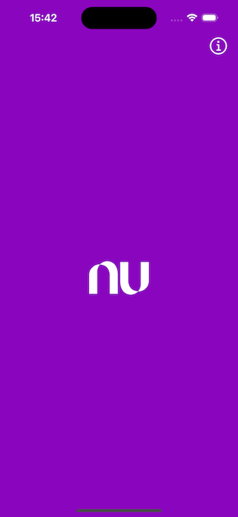

# Mobile Security Case

## Objetivo

Criar um aplicativo iOS que implementa diversas checagens de segurança durante sua execução, sem depender de bibliotecas externas.

## Descrição do Projeto

Este projeto tem como foco a implementação de detecções de segurança em tempo real dentro de um aplicativo iOS, com o objetivo de detectar se o ambiente de execução é seguro. As principais checagens de segurança incluem:

- **Jailbreak Detection**: Detecta se o dispositivo está com jailbreak.
- **Anti-Debugging Detection**: Detecta se o processo está sendo depurado.
- **Simulator Detection**: Detecta se o aplicativo está sendo executado em um simulador iOS.

O projeto utiliza um módulo chamado **NBSecurity**, responsável por realizar essas verificações de segurança. O **NBSecurity** pode informar se o aplicativo está seguro, verificando todas as camadas de segurança mencionadas acima.

- OBS: Hoje o módulo está dentro da pasta do aplicativo por conta do desafio. A ideia é abrir um novo repositório, instalando diretamente no aplicativo.

## Como Testar?

### 1. Testando no Simulador:

- Abra o Xcode e compile o projeto para o **Simulador iOS 16.0+**.
- Ao iniciar o aplicativo no simulador, o aplicativo deverá ser finalizado automaticamente, indicando que ele está sendo executado no simulador, o que é considerado um ambiente não seguro para testes de produção.

### 2. Testando no Dispositivo Físico:

- **Com Debug no Xcode**: Quando o aplicativo é executado com o modo de debug ativo, o aplicativo será finalizado. Isso acontece para evitar que o código seja executado em um ambiente de debug, que pode ser vulnerável.
  
- **Sem Debug (Execução Normal)**: Quando o aplicativo é instalado no dispositivo e executado sem estar no modo de debug, ele deverá verificar as condições de segurança e exibir um alerta de sucesso caso o ambiente esteja seguro.

#### Exemplo de Tela de Sucesso:
Ao iniciar o aplicativo em um dispositivo físico, sem debug, o app deverá mostrar a tela de sucesso indicando que não há suspeitas de segurança.

- Caso tenha alguma vulnerabilidade que o módulo criado tenha identificado, o app será finalizado.

#### Debug Session:

Durante a execução no modo **DEBUG**, é possível ativar uma variável chamada `SplashViewModel.isDebugSession`. Quando ativada, ela permite visualizar um ícone de informação no canto superior direito da tela. Ao clicar neste ícone, você pode acessar os logs relacionados à segurança do NBSecurity.

Se não houver logs, significa que o ambiente está seguro e não foi detectado nenhum problema.

### 3. Observação Importante:
- Para fins de depuração e testes, você pode modificar a variável `SplashViewModel.isDebugSession` para **true** para ativar a sessão de debug e visualizar os logs de segurança.

## Arquitetura do NBSecurity

O módulo **NBSecurity** é composto por diversas camadas de checagens, que incluem verificações de jailbreak, debugging e simulador. A arquitetura do módulo é ilustrada abaixo:

A arquitetura do **NBSecurity** é modular, permitindo que novas verificações de segurança possam ser facilmente adicionadas conforme necessário. Cada verificação de segurança é realizada de forma independente, garantindo que o aplicativo seja capaz de avaliar o ambiente e detectar possíveis vulnerabilidades sem comprometer o desempenho.
